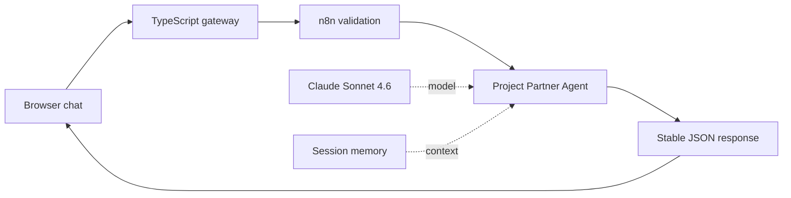

# Connect the Visual n8n Agent to Claude

## Outcome

At the end of this guide:

- n8n will show a small, documented visual agent workflow.
- The Claude API key will be stored only in n8n's encrypted credential store.
- The browser chat will send messages through n8n to Claude.
- Each browser conversation will have separate short-term memory.
- A second, credential-free workflow will provide a safe local health check.

Allow about 15 minutes after the local stack is running.

## Before starting

Complete [LOCAL_SETUP.md](LOCAL_SETUP.md), then confirm:

- Docker Desktop is running.
- The chat opens at [http://localhost:3000](http://localhost:3000).
- n8n opens at [http://localhost:5678](http://localhost:5678).
- A local n8n owner account has been created.
- One team member can sign in to the [Anthropic Console](https://console.anthropic.com/).

Anthropic API access is billed separately from a Claude web-chat subscription. The workspace needs a small amount of API credit before a real request can succeed. Anthropic documents [prepaid API billing](https://support.anthropic.com/en/articles/8977456-how-do-i-pay-for-my-api-usage) and [workspace spend limits](https://platform.claude.com/docs/en/manage-claude/workspaces).

## 1. Import the workflows

The repository includes two reviewed workflow exports. Learners do not need to build the nodes from a blank canvas.

### macOS

Double-click `import-workflows.command`.

If macOS blocks it, Control-click the file, choose **Open**, then confirm.

### Windows

Double-click `import-workflows-windows.cmd`.

The import opens a terminal, checks the workflow files, starts n8n if needed, imports both workflows, and restarts n8n. It does not import an API key or publish a workflow.

Refresh the n8n Projects page. These inactive drafts should appear:

- `00 - START HERE - Project Partner`
- `90 - DEBUG - Agent Health`

## 2. Create an Anthropic API key

Only one person on each team should handle the key.

1. Open the [Anthropic Console](https://console.anthropic.com/).
2. Select the intended workspace.
3. Open **Settings**, then **API keys**.
4. Create a new key for this local workshop.
5. Give it a recognisable name and an expiry date when that option is available.
6. Copy the key once and keep the Console tab open until it is saved in n8n.

Anthropic's [authentication guide](https://platform.claude.com/docs/en/manage-claude/authentication) explains how API keys authenticate requests.

Never put this key in `.env`, `agent.config.js`, a workflow sticky note, a screenshot, Git, or a chat message. If it is exposed, revoke it in the Anthropic Console and create a replacement.

## 3. Store the key in n8n

1. In n8n, open **Credentials**.
2. Select **Create credential**.
3. Search for and select **Anthropic**.
4. Set the credential name to `Anthropic account`.
5. Paste the key into **API Key**.
6. Leave **Base URL** at its default value.
7. Save the credential.

The key is encrypted using the private n8n encryption key generated during local setup. The browser chat and chat gateway never receive it.

## 4. Inspect and publish the agent

Open `00 - START HERE - Project Partner`. The sticky notes describe the three parts of the workflow.

| Part | What it does |
| --- | --- |
| **Chat Webhook** | Receives the private request from the chat gateway |
| **Validate and Normalise** | Checks the session UUID, trims the message, and rejects empty or oversized input |
| **Request Is Valid?** | Ensures only the valid branch can reach the agent |
| **Project Partner Agent** | Applies the assistant instructions and controls the number of model steps |
| **Claude - Sonnet 4.6** | Calls Claude using the n8n credential |
| **Conversation Memory** | Keeps six interactions for each browser session while n8n remains running |
| **Return Agent Reply** | Returns only `sessionId`, `reply`, and `runId` |
| **Return Invalid Request** | Returns a safe 400 or 413 response without calling Claude |

Then:

1. Open **Claude - Sonnet 4.6**.
2. Select `Anthropic account` under **Credential to connect with**.
3. Confirm the model is Claude Sonnet 4.6. The maintained model identifiers are listed in Anthropic's [model documentation](https://platform.claude.com/docs/en/about-claude/models/model-ids-and-versions).
4. Save the workflow.
5. Select **Publish**.

Keep the supplied safety and cost ceilings during the workshop:

- 4 agent iterations.
- 900 provider output tokens.
- 50-second workflow timeout.
- 8,000-character response ceiling.
- Streaming disabled for the synchronous chat contract.

## 5. Publish the safe health workflow

Open `90 - DEBUG - Agent Health`, inspect it, then select **Publish**.

Open [http://localhost:5678/webhook/agent-health](http://localhost:5678/webhook/agent-health). A successful response resembles:

```json
{
  "status": "ok",
  "service": "n8n",
  "workflow": "agent-health",
  "timestamp": "2026-07-26T00:00:00.000Z"
}
```

This proves that n8n can run a published workflow. It deliberately does not call Claude and does not reveal credentials, execution data, or configuration.

## 6. Send the first message

Open [http://localhost:3000](http://localhost:3000) and try:

> Help me turn my project idea into three clear next steps.

A successful request follows this path:



The browser creates a `sessionId` and reuses it for the conversation. Select **New conversation** to create a separate session.

## Memory and restart behaviour

The first release deliberately uses n8n Simple Memory so the lesson remains visual and small:

- The latest six interactions are available to the agent.
- Memory is isolated by the browser's `sessionId`.
- Memory exists only inside the running n8n process.
- Restarting or stopping n8n clears all conversation memory.
- The workflow, owner account, and encrypted Anthropic credential still persist.

This is appropriate for local teaching, but it is not durable production storage. A later cloud phase must replace it before scaling to multiple n8n processes.

## Troubleshooting

Use [TROUBLESHOOTING.md](TROUBLESHOOTING.md) when:

- The imported workflows do not appear.
- The chat says the agent is not ready.
- The Claude credential fails.
- The Anthropic workspace has no credit or reaches a rate limit.
- The agent health endpoint returns 404.
- The agent forgets a conversation after restart.

The browser shows safe, short errors. Open the most recent n8n execution to diagnose a failed node; do not copy credentials or complete execution payloads into a public issue.

## Technical contributor commands

Validate workflow structure without starting n8n:

```bash
node scripts/validate-workflows.mjs
```

Run the complete isolated Phase 3 smoke test:

```bash
./scripts/test-phase3.sh
```

The smoke test creates a separate Docker project and a fake local Anthropic endpoint. It proves imports, publication, invalid-input blocking, the browser-to-agent path, memory isolation, output limits, and restart behaviour without consuming API credit.

Export timestamped copies of visually edited workflows:

```bash
./scripts/export-workflows.sh
```

The ignored `n8n/exports/` directory is a review area, not the canonical source. Compare the exported JSON carefully before replacing files below `n8n/workflows/`.
